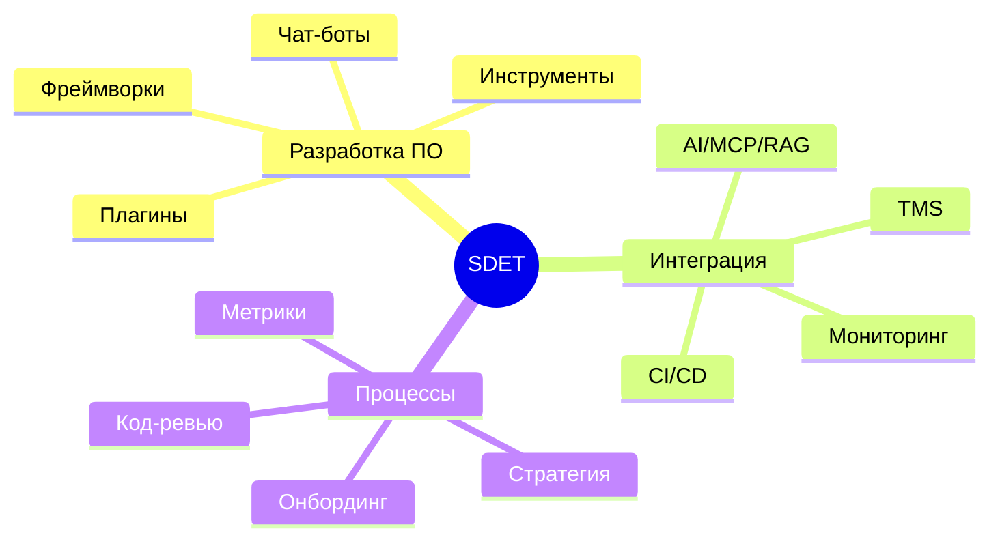
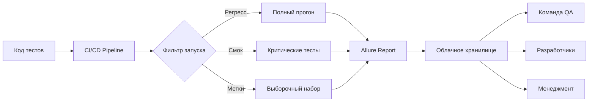
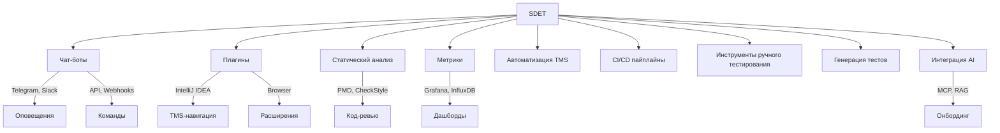
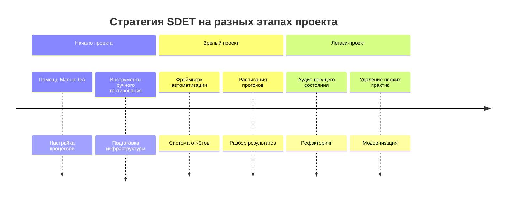
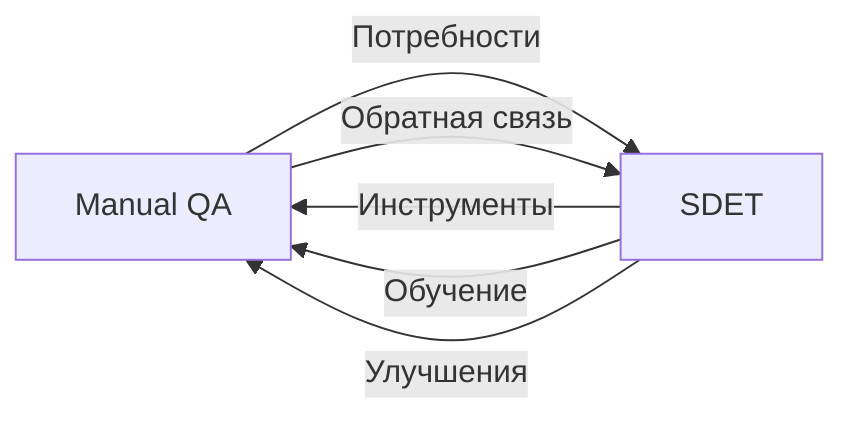

# Структура статьи: «Инструменты автоматизации в тестировании — SDET за пределами автотестов»

> **Статус:** В работе  
> **Автор:** [Имя автора]  
> **Целевая аудитория:** SDET, QA Lead, Automation QA, Manual QA  

---

## Общая концепция

SDET — это не только про автотесты. Это разработка ПО и интеграция инструментов для улучшения всего процесса тестирования: от инфраструктуры и пайплайнов до чат-ботов, плагинов и интеграции AI.

---

## План статьи

### Часть 1. Введение — Кто такой SDET

- [ ] Определение SDET: разработка ПО для специалистов ручного и автоматизированного тестирования
- [ ] Проблема: в связке SDET часто забывают про специалистов ручного тестирования
- [ ] Тезис: автоматизация — это инженерия пайплайна жизненного цикла ПО
- [ ] Тезис: SDET — это разработка ПО или интеграция существующего в процессы тестирования

### Часть 2. Инфраструктура автоматизации прогонов

- [ ] Разделение стендов: автотесты, ручное тестирование, разработка
- [ ] Разработка фреймворка автоматизации тестирования
- [ ] Автоматизация запусков: регресс, смок, метки, эпики
- [ ] Генерация отчётов и размещение на облаке

### Часть 3. Проблема ограниченного восприятия роли SDET

- [ ] Большинство компаний ограничиваются базовой инфраструктурой
- [ ] Делегирование SDET задач написания автотестов
- [ ] Упущенные возможности

### Часть 4. Расширенный инструментарий SDET

- [ ] **Чат-боты:** оповещения, команды запуска, проверка стендов, взаимодействие с API и вебхуками
- [ ] **Плагины и расширения:** IntelliJ IDEA (открытие тест-кейса по ключу), браузерные расширения
- [ ] **Статические анализаторы:** PMD, CheckStyle — упрощение код-ревью
- [ ] **Метрики и дашборды:** Grafana — сбор информации о тестировании и автоматизации
- [ ] **Автоматизация TMS:** переходы статусов, назначение задач
- [ ] **CI/CD пайплайны:** GitLab — собственные скрипты, Allure-отчёты
- [ ] **Настройка инструментов ручного тестирования**
- [ ] **Генерация тестов:** на основе документации TMS и/или контрактов API
- [ ] **Интеграция AI:** MCP, RAG, упрощение онбординга

### Часть 5. Стратегия автоматизации — когда SDET приходит на проект

- [ ] **Сценарий 1:** Начальный этап разработки — фокус на помощи ручному тестированию и процессах
- [ ] **Сценарий 2:** Продукт прошёл несколько итераций — создание системы автоматизации, отчётов, расписаний
- [ ] **Сценарий 3:** Легаси-проект — улучшение, рефакторинг, удаление плохих практик

### Часть 6. Специалисты ручного тестирования — главный клиент SDET

- [ ] Обсуждение процессов тестирования
- [ ] Выявление потребностей в инструментах
- [ ] Предложение и внедрение инструментов
- [ ] Обратная связь и итеративное улучшение

### Часть 7. Заключение

- [ ] Переосмысление роли SDET
- [ ] Ценность для команды и бизнеса
- [ ] Призыв к расширению горизонтов

---

## Отслеживание прогресса

| Раздел | Статус | Дата |
|--------|--------|------|
| Часть 1. Введение | ⬜ Не начато | — |
| Часть 2. Инфраструктура | ⬜ Не начато | — |
| Часть 3. Проблема | ⬜ Не начато | — |
| Часть 4. Инструментарий | ⬜ Не начато | — |
| Часть 5. Стратегия | ⬜ Не начато | — |
| Часть 6. Ручное тестирование | ⬜ Не начато | — |
| Часть 7. Заключение | ⬜ Не начато | — |
| Глоссарий | 🟡 В работе | 2026-02-26 |
